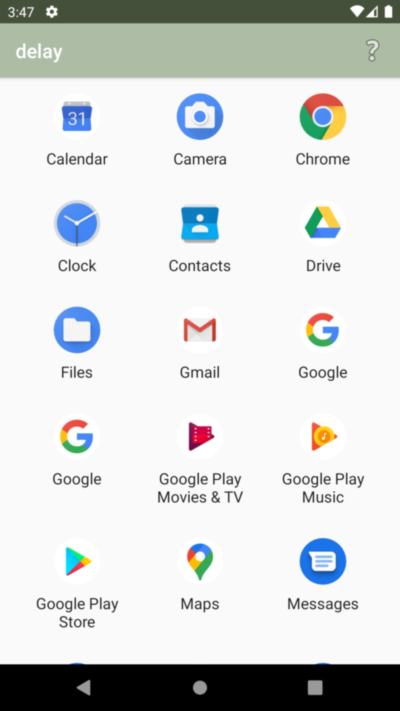
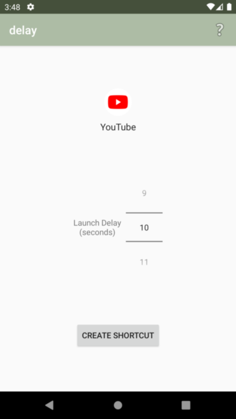
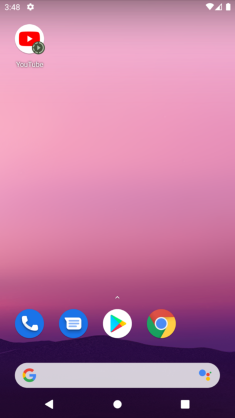
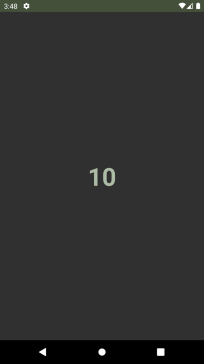

# delay

Android app for breaking muscle-memory app-use habits by decoupling the physical action from the neurological reward (inspired by the alt-text on https://xkcd.com/862/).

I find my brain often autopilots to mindlessly scrolling the Facebook app when I'm trying to be productive.
Moving the shortcut or turning on the Android 10 Focus Mode didn't help, because within a couple days I would be back to autopiloting the new shortcut location, or disabling Focus Mode.

What _has_ helped is inserting a non-skippable delay before launching a distracting app -- just long enough to make me consciously ask myself whether this is a good use of my time.

## Screenshots

Choose installed app          |  Configure shortcut                     | Launcher shortcut created     | Countdown slows app launch
:----------------------------:|:---------------------------------------:|:-----------------------------:|:-----------------------------:|
 |  |  | 

## Privacy

This app terminates itself after launch, so nothing runs in the background, and this app requires no device permissions.

Still, even app-use metadata is sensitive, so the app doesn't collect any sort of analytics (you can check the source to verify there's no internet use whatsoever!).
